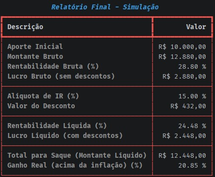

# 💲 Simulador Financeiro
Uma ferramenta simples para calcular o crescimento de valores através de regimes de `juros simples` ou `juros compostos`.

## 🛠️ Tecnologias e Bibliotecas utilizadas
* **Linguagem**: Python 3
* **Bibliotecas**: `abc` (criação de classes abstratas), `time` (controle de fluxo), `rich` (formatação visual)
* **Ambiente**: PyCharm

## 📋 Lista de Comandos

|Comando|Descrição|Inputs|
| :---: | :---: | :---: |
|`1`|Juros Simples|`Aporte inicial (R$)`, `Taxa de juros mensal (%)`, `Tempo de investimento (meses)` e `Taxa de inflação no período (%)`|
|`2`|Juros Compostos|`Aporte inicial (R$)`, `Taxa de juros mensal (%)`, `Tempo de investimento (meses)`, `Taxa de inflação no período (%)` e `Aporte mensal (R$)`|
|`3`|Sair do programa|`None`|

## 📄 Exportação de Resultados
Ao final de cada simulação, o programa oferece a opção de salvar os resultados em um arquivo `.txt` no diretório atual.
O arquivo gerado contém todos os indicadores da simulação (montante bruto, rendimento líquido, imposto, inflação, etc.), funcionando como um comprovante ou histórico da consulta realizada.

## 📊 Indicadores de Resultado da Simulação

**Visão Bruta (sem descontos)**
* **Investimento**: Refere-se ao aporte inicial somado aos aportes mensais realizados ao longo do tempo.
* **Montante Bruto**: O valor total final da aplicação antes de qualquer dedução.
* **Rentabilidade Bruta (%)**: O percentual total de ganho sobre o capital investido.
* **Rendimento Bruto (Lucro Bruto)**: O valor em dinheiro gerado apenas pelos juros acumulados.

**Impostos**
* **Alíquota de IR(%)**: A porcentagem de Imposto de Renda aplicada sobre o rendimento.
* **Valor do desconto**: A quantia exata em dinheiro que será descontada para o governo.

**Visão Líquida (com descontos)**
* **Rentabilidade Líquida (%)**: O percentual de ganho real que sobra após o desconto do Imposto de Renda.
* **Rendimento Líquido (Lucro Líquido)**: O lucro em dinheiro que efetivamente vai para o seu bolso.
* **Total para saque (Montante Líquido)**: O valor final total (Capital + Rendimento Líquido) disponível para resgate.

**Poder de compra (Inflação)**
* **Ganho Real**: É o lucro que sobra após descontar a inflação; ele mostra se o seu dinheiro realmente valerá mais do que no início ou se apenas acompanhou o aumento dos preços.

**DEMONSTRATIVO**

---

## 🚀 Como Executar
1. Certifique-se de ter o **Python** instalado.
2. Baixe os arquivos `main.py`, `base.py`, `simulators.py`, `services.py` e `view.py`.
3. Se utilizar PyCharm: Habilite `Emulate terminal in output` em `Run > Edit configurations > Edit configuration templates > Python > Modify options` para visualizar a interface colorida deste gestor.

---
Desenvolvido por **Celso Henrique Pereira Benassi**.
